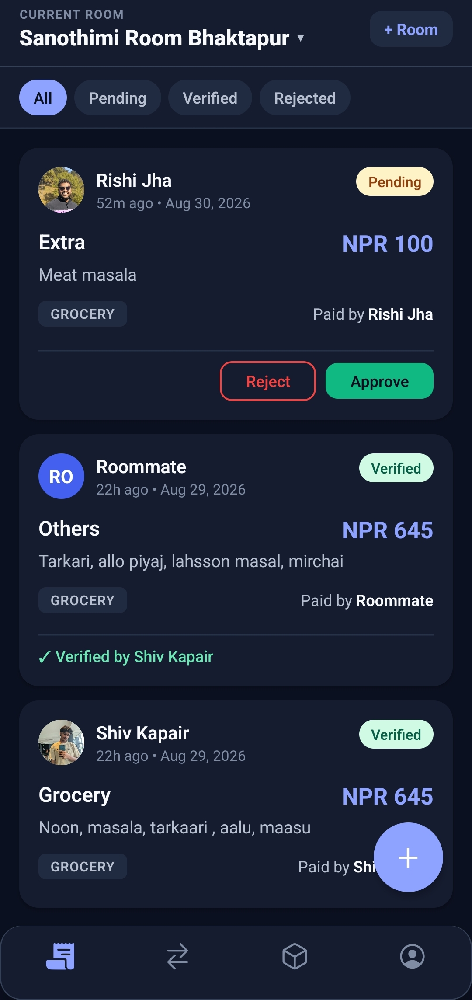
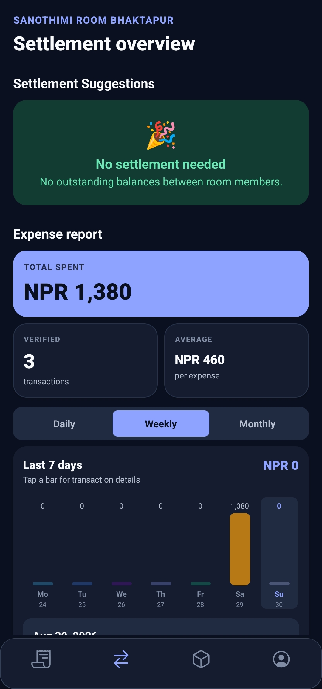
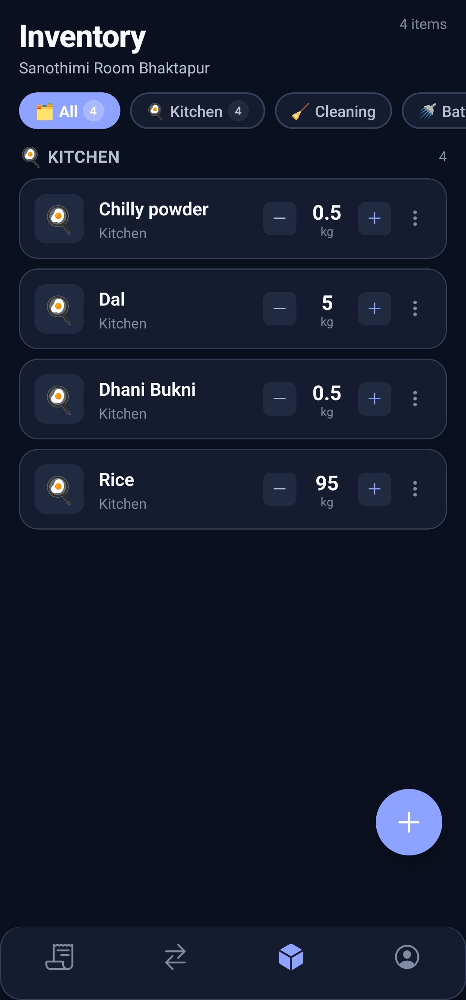
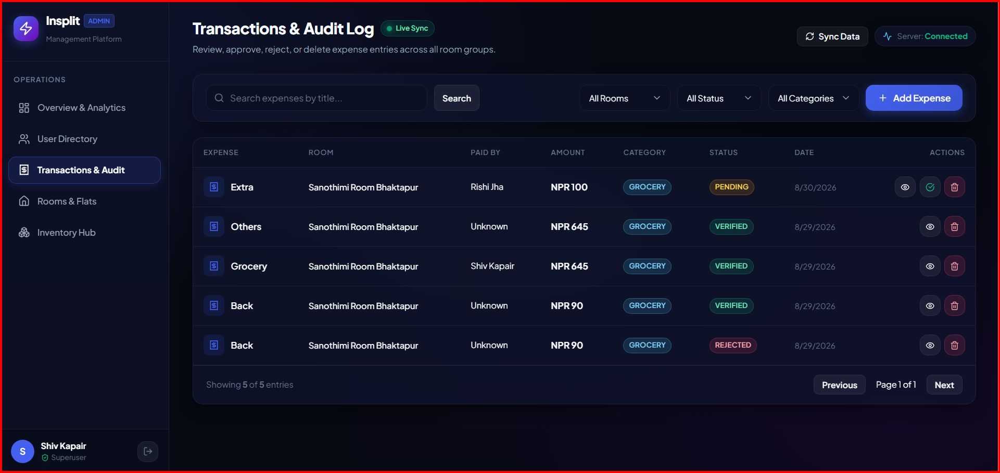
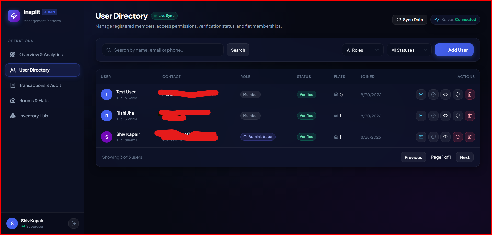
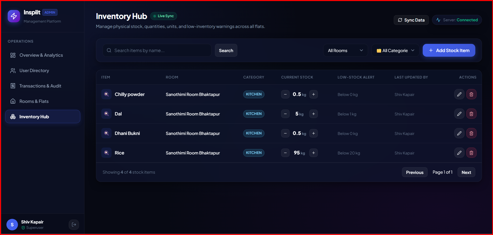

<div align="center">
  

  <h3>Shared living, without the awkward money conversations.</h3>

  <p>Split expenses, settle balances, manage shared supplies, and keep everyone in sync from one app.</p>

  <p>
    
    
    
    
  </p>
</div>

## See Insplit in action

<table>
  <tr>
    <td align="center"></td>
    <td align="center"></td>
    <td align="center"></td>
  </tr>
  <tr>
    <td align="center"><b>Review expenses</b><br/><sub>Approve or reject group purchases</sub></td>
    <td align="center"><b>Understand spending</b><br/><sub>See balances, trends, and totals</sub></td>
    <td align="center"><b>Track shared supplies</b><br/><sub>Update household stock together</sub></td>
  </tr>
</table>

## Built-in operations dashboard

<table>
  <tr>
    <td align="center"></td>
    <td align="center"></td>
  </tr>
  <tr>
    <td align="center"><b>Transactions & audit</b></td>
    <td align="center"><b>Users & permissions</b></td>
  </tr>
</table>

<p align="center">
  
  <br/>
  <b>Inventory across every room</b>
</p>

## Everything a household needs

| | Feature | What it does |
| :---: | --- | --- |
| 💸 | **Split expenses** | Record purchases, attach receipts, and let roommates verify each entry. |
| 🤝 | **Settle together** | Track balances and approve settlements so payments never get lost. |
| 🏠 | **Create shared rooms** | Invite and manage the people who share a home or group budget. |
| 🧺 | **Share inventory** | Keep household supplies visible and know what needs replacing. |
| ⚡ | **Stay up to date** | Receive push notifications and live updates when activity happens. |
| 🔐 | **Sign in securely** | Use email verification, password recovery, and supported biometrics. |
| 📊 | **Manage at a glance** | Review users, rooms, transactions, inventory, and analytics from the admin dashboard. |

## How it fits together

```text
Mobile app  ─┐
             ├── Express API ── MongoDB
Admin panel ─┘        │
                 Socket.IO + push notifications
```

Built with **Expo + React Native**, **React + Vite**, **Node.js + Express**,
**MongoDB**, and **Socket.IO**.

## Run locally

You need Node.js 20+, npm, and MongoDB.

```powershell
# Install each part
npm install --prefix server
npm install --prefix mobile
npm install --prefix web

# Create environment files from the included examples
Copy-Item server/.env.example server/.env
Copy-Item mobile/.env.example mobile/.env
Copy-Item web/.env.example web/.env
```

Add your database URL and secrets to `server/.env`, then start each app in its own terminal:

```powershell
npm run dev --prefix server
npm start --prefix mobile
npm run dev --prefix web
```

For production configuration, email setup, and release checks, see [DEPLOYMENT.md](./DEPLOYMENT.md).

## Project layout

```text
mobile/   Expo mobile app
server/   Express, MongoDB, and Socket.IO API
web/      React administration dashboard
```

<div align="center">
  <sub>Made for roommates, families, trips, and small groups.</sub>
</div>
